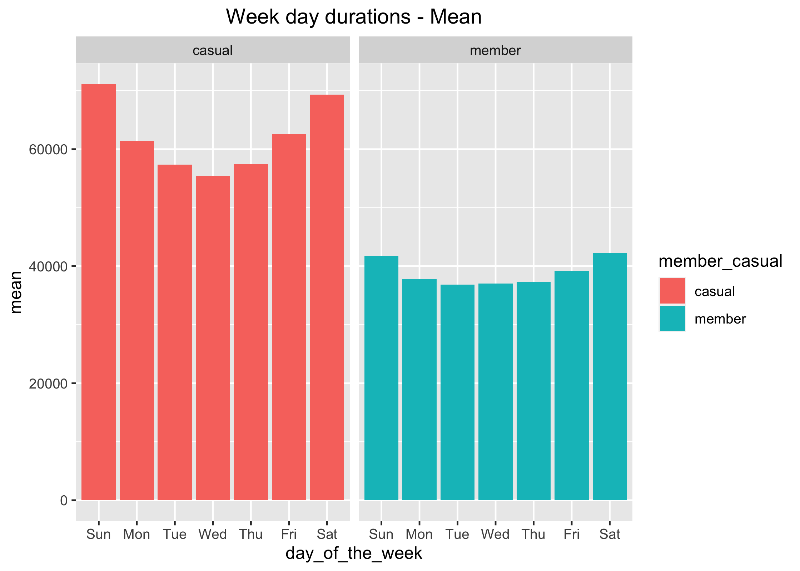
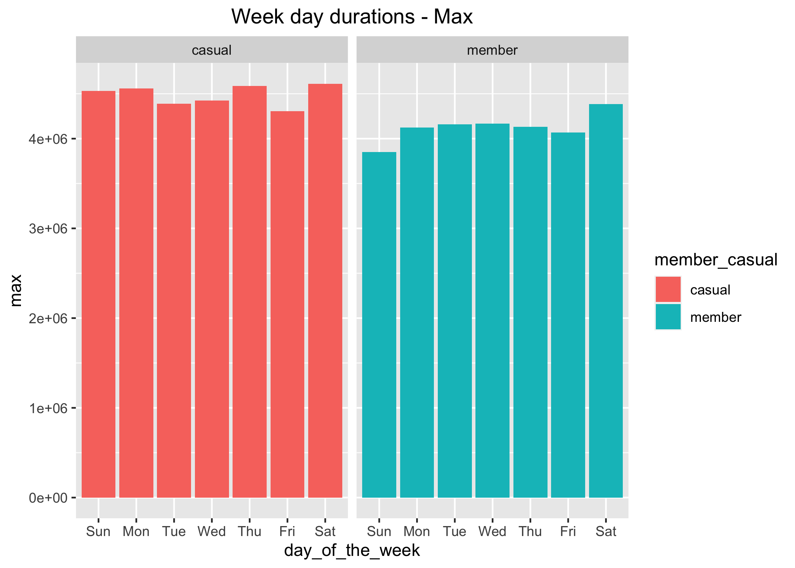
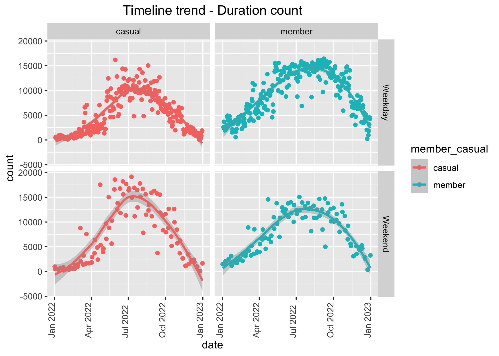
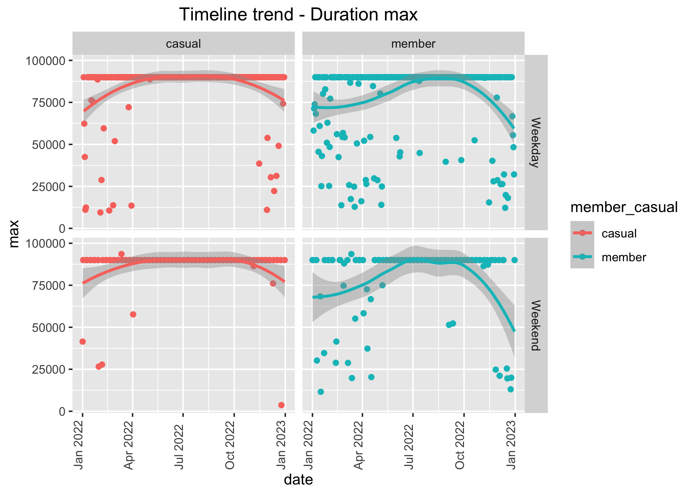
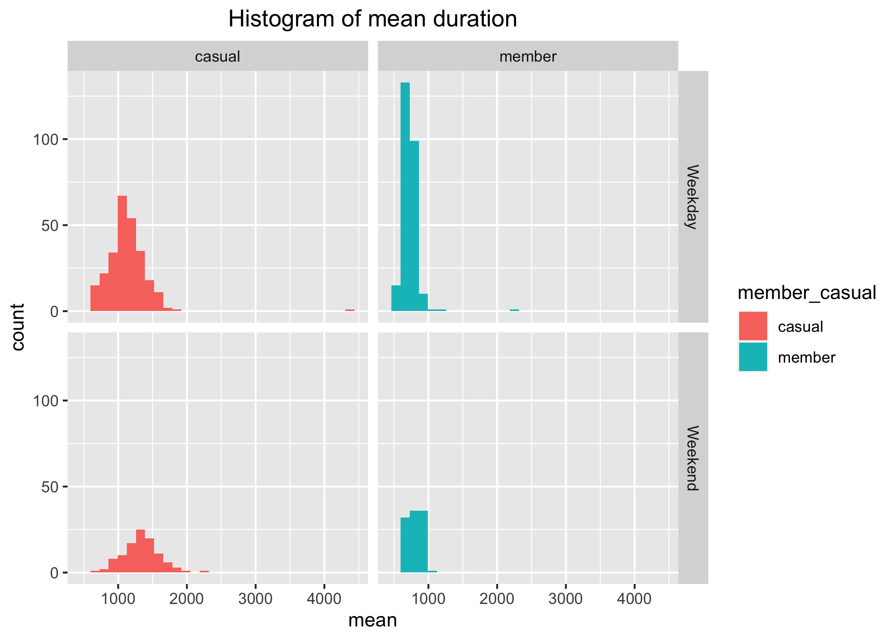

Case Study 1
================
Rithvik Shamrao Vinekar
2023-02-15

- <a href="#ask" id="toc-ask">Ask</a>
  - <a href="#the-stakeholders" id="toc-the-stakeholders">The
    stakeholders:</a>
  - <a href="#the-question-to-be-answered-is"
    id="toc-the-question-to-be-answered-is">The question to be answered
    is:</a>
    - <a
      href="#these-questions-below-are-not-asked-but-any-insight-will-be-helpful-in-that-direction-as-well"
      id="toc-these-questions-below-are-not-asked-but-any-insight-will-be-helpful-in-that-direction-as-well">These
      questions below are not asked, but any insight will be helpful in that
      direction as well</a>
- <a href="#prepare" id="toc-prepare">Prepare</a>
  - <a href="#the-initial-environment" id="toc-the-initial-environment">The
    Initial environment</a>
  - <a href="#load-required-libraries" id="toc-load-required-libraries">Load
    required libraries</a>
  - <a href="#download-data" id="toc-download-data">Download data</a>
  - <a href="#unzip-data" id="toc-unzip-data">Unzip data</a>
- <a href="#process" id="toc-process">Process</a>
  - <a href="#reading-the-data" id="toc-reading-the-data">Reading the
    data</a>
  - <a href="#checking-the-data" id="toc-checking-the-data">Checking the
    data</a>
  - <a href="#creating-new-variables"
    id="toc-creating-new-variables">Creating new variables</a>
- <a href="#analyse" id="toc-analyse">Analyse</a>
  - <a href="#extracting-information"
    id="toc-extracting-information">Extracting information</a>
    - <a href="#what-day-of-the-week" id="toc-what-day-of-the-week">What day
      of the week</a>
    - <a href="#weekly-trips-on-working-day-or-weekend"
      id="toc-weekly-trips-on-working-day-or-weekend">Weekly trips on working
      day or weekend?</a>
    - <a href="#what-type-of-bike-is-preferred"
      id="toc-what-type-of-bike-is-preferred">What type of bike is
      preferred?</a>
  - <a href="#data-for-weekdays" id="toc-data-for-weekdays">Data for
    weekdays</a>
    - <a href="#count" id="toc-count">Count</a>
    - <a href="#mean" id="toc-mean">Mean</a>
    - <a href="#max" id="toc-max">Max</a>
  - <a href="#weekdays-vs-weekends" id="toc-weekdays-vs-weekends">Weekdays
    vs Weekends</a>
    - <a href="#sum" id="toc-sum">Sum</a>
    - <a href="#mean-1" id="toc-mean-1">Mean</a>
    - <a href="#count-1" id="toc-count-1">Count</a>
    - <a href="#max-1" id="toc-max-1">Max</a>
    - <a href="#type-of-bike" id="toc-type-of-bike">Type of Bike</a>
    - <a href="#commute-data" id="toc-commute-data">Commute data</a>
  - <a href="#synopsis-of-study" id="toc-synopsis-of-study">Synopsis of
    study</a>
  - <a href="#share" id="toc-share">Share</a>
  - <a href="#act" id="toc-act">Act</a>

# Ask

The question and guide for the project is [given
here](aacF81H_TsWnBfNR_x7FIg_36299b28fa0c4a5aba836111daad12f1_DAC8-Case-Study-1.pdf).
A [presentation](Presentation.pptx) is also made.

## The stakeholders:

- **Lily Moreno:** The director of marketing and manager

- **Cyclistic marketing analytics team**

- **Cyclistic executive team**

## The question to be answered is:

- *How do annual **members** and **casual** riders use Cyclistic bikes
  **differently**?*

### These questions below are not asked, but any insight will be helpful in that direction as well

- Why would casual riders buy Cyclistic annual memberships?

- How can Cyclistic use digital media to influence casual riders to
  become members?

# Prepare

## The Initial environment

``` r
sessionInfo()
```

    ## R version 4.2.2 (2022-10-31)
    ## Platform: aarch64-apple-darwin20 (64-bit)
    ## Running under: macOS Ventura 13.2
    ## 
    ## Matrix products: default
    ## BLAS:   /Library/Frameworks/R.framework/Versions/4.2-arm64/Resources/lib/libRblas.0.dylib
    ## LAPACK: /Library/Frameworks/R.framework/Versions/4.2-arm64/Resources/lib/libRlapack.dylib
    ## 
    ## locale:
    ## [1] en_US.UTF-8/en_US.UTF-8/en_US.UTF-8/C/en_US.UTF-8/en_US.UTF-8
    ## 
    ## attached base packages:
    ## [1] stats     graphics  grDevices utils     datasets  methods   base     
    ## 
    ## loaded via a namespace (and not attached):
    ##  [1] compiler_4.2.2  fastmap_1.1.0   cli_3.6.0       tools_4.2.2    
    ##  [5] htmltools_0.5.4 rstudioapi_0.14 yaml_2.3.7      rmarkdown_2.20 
    ##  [9] knitr_1.42      xfun_0.36       digest_0.6.31   rlang_1.0.6    
    ## [13] evaluate_0.20

## Load required libraries

``` r
if (!require("tidyverse")) install.packages("tidyverse")
```

    ## Loading required package: tidyverse

    ## ── Attaching packages ─────────────────────────────────────── tidyverse 1.3.2 ──
    ## ✔ ggplot2 3.4.0      ✔ purrr   1.0.1 
    ## ✔ tibble  3.1.8      ✔ dplyr   1.0.10
    ## ✔ tidyr   1.3.0      ✔ stringr 1.5.0 
    ## ✔ readr   2.1.3      ✔ forcats 0.5.2 
    ## ── Conflicts ────────────────────────────────────────── tidyverse_conflicts() ──
    ## ✖ dplyr::filter() masks stats::filter()
    ## ✖ dplyr::lag()    masks stats::lag()

``` r
library(tidyverse)
if (!require("lubridate")) install.packages("lubridate")
```

    ## Loading required package: lubridate
    ## 
    ## Attaching package: 'lubridate'
    ## 
    ## The following objects are masked from 'package:base':
    ## 
    ##     date, intersect, setdiff, union

``` r
library(lubridate)
```

## Download data

The data is obtained from
[tripdata](https://divvy-tripdata.s3.amazonaws.com/index.html) provided
for this study. We will use only the data for the year 2022, from 1st
Jan 2022 to 31st Dec 2022. We will automate download, and clean up, so
our git directory is clean

``` r
url_base <- "https://divvy-tripdata.s3.amazonaws.com"
filename_pattern <- "2022%02d-divvy-tripdata.zip"
url_zip <- paste(url_base,filename_pattern,sep="/")
url_source <-sprintf(url_zip,1:12) 
file_dest <- sprintf(filename_pattern,1:12)
```

<!-- Method libcurl to ensure this works in Rmarkdown. Without this, -->
<!-- method=auto is default It works standalone, but fails on knit -->

``` r
download.file(url_source,file_dest, method="libcurl")
rm(url_zip,filename_pattern, url_source, file_dest)
```

## Unzip data

For this, the data in csv files is downloaded to local drive as zip
files. They match the regular expression pattern “2022.*divvy.*.zip”,
and are unzipped. The zip files are deleted immediately

``` r
lst <- list.files(path = ".", pattern = "2022.*divvy.*.zip",full.names = TRUE)
sapply(lst, unzip, exdir = ".") 
```

    ##      ./202201-divvy-tripdata.zip             
    ## [1,] "./202201-divvy-tripdata.csv"           
    ## [2,] "./__MACOSX/._202201-divvy-tripdata.csv"
    ##      ./202202-divvy-tripdata.zip             
    ## [1,] "./202202-divvy-tripdata.csv"           
    ## [2,] "./__MACOSX/._202202-divvy-tripdata.csv"
    ##      ./202203-divvy-tripdata.zip             
    ## [1,] "./202203-divvy-tripdata.csv"           
    ## [2,] "./__MACOSX/._202203-divvy-tripdata.csv"
    ##      ./202204-divvy-tripdata.zip             
    ## [1,] "./202204-divvy-tripdata.csv"           
    ## [2,] "./__MACOSX/._202204-divvy-tripdata.csv"
    ##      ./202205-divvy-tripdata.zip             
    ## [1,] "./202205-divvy-tripdata.csv"           
    ## [2,] "./__MACOSX/._202205-divvy-tripdata.csv"
    ##      ./202206-divvy-tripdata.zip             
    ## [1,] "./202206-divvy-tripdata.csv"           
    ## [2,] "./__MACOSX/._202206-divvy-tripdata.csv"
    ##      ./202207-divvy-tripdata.zip             
    ## [1,] "./202207-divvy-tripdata.csv"           
    ## [2,] "./__MACOSX/._202207-divvy-tripdata.csv"
    ##      ./202208-divvy-tripdata.zip             
    ## [1,] "./202208-divvy-tripdata.csv"           
    ## [2,] "./__MACOSX/._202208-divvy-tripdata.csv"
    ##      ./202209-divvy-tripdata.zip                   
    ## [1,] "./202209-divvy-publictripdata.csv"           
    ## [2,] "./__MACOSX/._202209-divvy-publictripdata.csv"
    ##      ./202210-divvy-tripdata.zip             
    ## [1,] "./202210-divvy-tripdata.csv"           
    ## [2,] "./__MACOSX/._202210-divvy-tripdata.csv"
    ##      ./202211-divvy-tripdata.zip             
    ## [1,] "./202211-divvy-tripdata.csv"           
    ## [2,] "./__MACOSX/._202211-divvy-tripdata.csv"
    ##      ./202212-divvy-tripdata.zip             
    ## [1,] "./202212-divvy-tripdata.csv"           
    ## [2,] "./__MACOSX/._202212-divvy-tripdata.csv"

``` r
unlink(lst)
```

I don’t need that \_\_MACOSX directory.

``` r
unlink("__MACOSX", recursive = TRUE)
```

# Process

To begin processing this data, we will first load the packages we need.
The code below attempts to install the packages if it does not find them
in the library, and loads them later

## Reading the data

The csv files have been downloaded. They are now read and immediately
deleted after that.

## Checking the data

Lets look at the data

``` r
names(tripdata)
```

    ##  [1] "ride_id"            "rideable_type"      "started_at"        
    ##  [4] "ended_at"           "start_station_name" "start_station_id"  
    ##  [7] "end_station_name"   "end_station_id"     "start_lat"         
    ## [10] "start_lng"          "end_lat"            "end_lng"           
    ## [13] "member_casual"

These are column names

``` r
str(tripdata)
```

    ## spc_tbl_ [5,667,717 × 13] (S3: spec_tbl_df/tbl_df/tbl/data.frame)
    ##  $ ride_id           : chr [1:5667717] "C2F7DD78E82EC875" "A6CF8980A652D272" "BD0F91DFF741C66D" "CBB80ED419105406" ...
    ##  $ rideable_type     : chr [1:5667717] "electric_bike" "electric_bike" "classic_bike" "classic_bike" ...
    ##  $ started_at        : POSIXct[1:5667717], format: "2022-01-13 11:59:47" "2022-01-10 08:41:56" ...
    ##  $ ended_at          : POSIXct[1:5667717], format: "2022-01-13 12:02:44" "2022-01-10 08:46:17" ...
    ##  $ start_station_name: chr [1:5667717] "Glenwood Ave & Touhy Ave" "Glenwood Ave & Touhy Ave" "Sheffield Ave & Fullerton Ave" "Clark St & Bryn Mawr Ave" ...
    ##  $ start_station_id  : chr [1:5667717] "525" "525" "TA1306000016" "KA1504000151" ...
    ##  $ end_station_name  : chr [1:5667717] "Clark St & Touhy Ave" "Clark St & Touhy Ave" "Greenview Ave & Fullerton Ave" "Paulina St & Montrose Ave" ...
    ##  $ end_station_id    : chr [1:5667717] "RP-007" "RP-007" "TA1307000001" "TA1309000021" ...
    ##  $ start_lat         : num [1:5667717] 42 42 41.9 42 41.9 ...
    ##  $ start_lng         : num [1:5667717] -87.7 -87.7 -87.7 -87.7 -87.6 ...
    ##  $ end_lat           : num [1:5667717] 42 42 41.9 42 41.9 ...
    ##  $ end_lng           : num [1:5667717] -87.7 -87.7 -87.7 -87.7 -87.6 ...
    ##  $ member_casual     : chr [1:5667717] "casual" "casual" "member" "casual" ...
    ##  - attr(*, "spec")=
    ##   .. cols(
    ##   ..   ride_id = col_character(),
    ##   ..   rideable_type = col_character(),
    ##   ..   started_at = col_datetime(format = ""),
    ##   ..   ended_at = col_datetime(format = ""),
    ##   ..   start_station_name = col_character(),
    ##   ..   start_station_id = col_character(),
    ##   ..   end_station_name = col_character(),
    ##   ..   end_station_id = col_character(),
    ##   ..   start_lat = col_double(),
    ##   ..   start_lng = col_double(),
    ##   ..   end_lat = col_double(),
    ##   ..   end_lng = col_double(),
    ##   ..   member_casual = col_character()
    ##   .. )
    ##  - attr(*, "problems")=<externalptr>

This provides the formats for the data read. As we can see, some columns
are better off as factors

Columns we should have as factors are: rideable_type and member_casual

``` r
tripdata$rideable_type <- as.factor(tripdata$rideable_type)
table(tripdata$rideable_type)
```

    ## 
    ##  classic_bike   docked_bike electric_bike 
    ##       2601214        177474       2889029

``` r
tripdata$member_casual <- as.factor(tripdata$member_casual)
table(tripdata$member_casual)
```

    ## 
    ##  casual  member 
    ## 2322032 3345685

OK, there are no spurious entries for these factors. The dates are ok.
Are there NA values?

``` r
sum(is.na(tripdata$started_at))
```

    ## [1] 0

``` r
sum(is.na(tripdata$ended_at))
```

    ## [1] 0

``` r
sum(is.na(tripdata$ride_id))
```

    ## [1] 0

``` r
sum(is.na(tripdata$rideable_type))
```

    ## [1] 0

``` r
sum(is.na(tripdata$start_lat))
```

    ## [1] 0

``` r
sum(is.na(tripdata$end_lat))
```

    ## [1] 5858

``` r
sum(is.na(tripdata$start_lng))
```

    ## [1] 0

``` r
sum(is.na(tripdata$end_lng))
```

    ## [1] 5858

Only the end_lat and end_lng have an identical number of NAs. Why?

``` r
table(tripdata[is.na(tripdata$end_lng),]$rideable_type)
```

    ## 
    ##  classic_bike   docked_bike electric_bike 
    ##          3242          2616             0

This really doesn’t say much.

## Creating new variables

We need to derive some additional data from the columns already present

1.  Duration of the ride - **duration**

2.  Date, extract from timestamp ‘started_at’ We will ignore corner
    cases where rides were taken around midnight, and use only
    started_at for the same - **date**

3.  Weekday - Sunday, Monday etc. that the ride was taken -
    **day_of_the_week** - a factor

4.  Whether the ride was a weekday ride(Mon..Fri) or a weekend
    ride(Sat,Sun) - **weekday_or_end** - a factor

5.  A combination of start_station_id and end_station_id - **commute**

For duration, it is simple. Luckily, the started_at and ended_at are
both in POSIX_ct format as timestamps.

``` r
tripdata$duration <- as.numeric(difftime(tripdata$ended_at,tripdata$started_at, units = "secs"))
```

``` r
sum(tripdata$duration<0)
```

    ## [1] 100

``` r
sum(tripdata$duration==0)
```

    ## [1] 431

Remove spurious data. Only duration\>0 should be included. The 100
negative entries are likely errors in entry.

``` r
tripdata[tripdata$duration==0,]
```

    ## # A tibble: 431 × 14
    ##    ride_id       ridea…¹ started_at          ended_at            start…² start…³
    ##    <chr>         <fct>   <dttm>              <dttm>              <chr>   <chr>  
    ##  1 C2E047DDF019… electr… 2022-01-18 19:25:42 2022-01-18 19:25:42 Green … TA1307…
    ##  2 8D3E8E511FEB… electr… 2022-01-21 01:05:35 2022-01-21 01:05:35 Wester… 13068  
    ##  3 A753A729011B… electr… 2022-01-09 10:39:48 2022-01-09 10:39:48 Clark … KA1504…
    ##  4 0C63D14D2612… electr… 2022-01-28 15:28:11 2022-01-28 15:28:11 Wells … TA1307…
    ##  5 4B0FC5ACEE52… electr… 2022-01-18 19:38:26 2022-01-18 19:38:26 Sheffi… TA1309…
    ##  6 6174209419E9… classi… 2022-02-17 14:20:58 2022-02-17 14:20:58 Univer… KA1503…
    ##  7 FA080339DCF1… classi… 2022-02-12 15:07:50 2022-02-12 15:07:50 Michig… TA1305…
    ##  8 2CF1A9AEEB7A… electr… 2022-02-17 09:39:01 2022-02-17 09:39:01 Despla… 15535  
    ##  9 21582FCE30A6… classi… 2022-02-16 14:32:32 2022-02-16 14:32:32 Canal … 13011  
    ## 10 CF76E9E68F30… classi… 2022-02-24 07:41:45 2022-02-24 07:41:45 Ashlan… 13224  
    ## # … with 421 more rows, 8 more variables: end_station_name <chr>,
    ## #   end_station_id <chr>, start_lat <dbl>, start_lng <dbl>, end_lat <dbl>,
    ## #   end_lng <dbl>, member_casual <fct>, duration <dbl>, and abbreviated
    ## #   variable names ¹​rideable_type, ²​start_station_name, ³​start_station_id

Its not clear why there are entries for 0 sec durations as they are
either maintenance calls or errors. So we will remove all these:

``` r
summary(tripdata$duration)
```

    ##    Min. 1st Qu.  Median    Mean 3rd Qu.    Max. 
    ## -621201     349     617    1167    1108 2483235

``` r
tripdata <- tripdata[tripdata$duration>0,]
```

``` r
summary(tripdata$duration)
```

    ##    Min. 1st Qu.  Median    Mean 3rd Qu.    Max. 
    ##       1     349     617    1167    1108 2483235

The summary here shows that there are large number of negative values
which are invalid, as well as very large durations, which may be valid,
but are special cases. We need to dig out the reason they are there.
Date can easily be extracted using started_at

``` r
tripdata$date <- lubridate::date(tripdata$started_at)
```

From this, we get the day_of_the_week

``` r
tripdata$day_of_the_week <- as.factor(wday(tripdata$started_at, label=TRUE))
```

We now need to decide whether the day is a weekday or weekend. This is
simple:

``` r
weekday_or_end <- function(day) ifelse(day=="Sat"|day=="Sun","Weekend","Weekday") 
```

We define the simple one-line function. Then we plug it into the
assignment below. Note that these values should be factors

``` r
tripdata$weekday_or_end <- as.factor(weekday_or_end(as.character(tripdata$day_of_the_week)))
```

One last check

``` r
str(tripdata)
```

    ## tibble [5,667,186 × 17] (S3: tbl_df/tbl/data.frame)
    ##  $ ride_id           : chr [1:5667186] "C2F7DD78E82EC875" "A6CF8980A652D272" "BD0F91DFF741C66D" "CBB80ED419105406" ...
    ##  $ rideable_type     : Factor w/ 3 levels "classic_bike",..: 3 3 1 1 1 1 1 1 3 1 ...
    ##  $ started_at        : POSIXct[1:5667186], format: "2022-01-13 11:59:47" "2022-01-10 08:41:56" ...
    ##  $ ended_at          : POSIXct[1:5667186], format: "2022-01-13 12:02:44" "2022-01-10 08:46:17" ...
    ##  $ start_station_name: chr [1:5667186] "Glenwood Ave & Touhy Ave" "Glenwood Ave & Touhy Ave" "Sheffield Ave & Fullerton Ave" "Clark St & Bryn Mawr Ave" ...
    ##  $ start_station_id  : chr [1:5667186] "525" "525" "TA1306000016" "KA1504000151" ...
    ##  $ end_station_name  : chr [1:5667186] "Clark St & Touhy Ave" "Clark St & Touhy Ave" "Greenview Ave & Fullerton Ave" "Paulina St & Montrose Ave" ...
    ##  $ end_station_id    : chr [1:5667186] "RP-007" "RP-007" "TA1307000001" "TA1309000021" ...
    ##  $ start_lat         : num [1:5667186] 42 42 41.9 42 41.9 ...
    ##  $ start_lng         : num [1:5667186] -87.7 -87.7 -87.7 -87.7 -87.6 ...
    ##  $ end_lat           : num [1:5667186] 42 42 41.9 42 41.9 ...
    ##  $ end_lng           : num [1:5667186] -87.7 -87.7 -87.7 -87.7 -87.6 ...
    ##  $ member_casual     : Factor w/ 2 levels "casual","member": 1 1 2 1 2 2 2 2 2 2 ...
    ##  $ duration          : num [1:5667186] 177 261 261 896 362 ...
    ##  $ date              : Date[1:5667186], format: "2022-01-13" "2022-01-10" ...
    ##  $ day_of_the_week   : Ord.factor w/ 7 levels "Sun"<"Mon"<"Tue"<..: 5 2 3 3 5 3 1 7 2 6 ...
    ##  $ weekday_or_end    : Factor w/ 2 levels "Weekday","Weekend": 1 1 1 1 1 1 2 2 1 1 ...

OK

# Analyse

## Extracting information

For analysis, we can generate a large number of graphs, only some of
which may make sense, while others may give the same basic information.
The various factor variables are member_casual, weekday_or_end,
rideable_type and day_of_the_week. All of these can be used for
group_by. The member_casual factor is key, as the question to be
answered revolves around it. So we will generate group-based analysis
for each of the other factors. The value we need to check is duration,
as it is the billable quantity here. We take sum, mean, mode, max, min
and count.

``` r
max(tripdata$duration)
```

    ## [1] 2483235

``` r
tripdata[tripdata$duration==max(tripdata$duration),c("rideable_type","duration","member_casual")]
```

    ## # A tibble: 1 × 3
    ##   rideable_type duration member_casual
    ##   <fct>            <dbl> <fct>        
    ## 1 docked_bike    2483235 casual

The duration greater than 24 hrs i.e. 86400 sec

``` r
table(tripdata[tripdata$duration>86400,]$rideable_type)
```

    ## 
    ##  classic_bike   docked_bike electric_bike 
    ##          3323          2037             0

``` r
tripdata[tripdata$duration>86400 & as.character(tripdata$rideable_type)=="classic_bike",c("rideable_type","duration","member_casual")]
```

    ## # A tibble: 3,323 × 3
    ##    rideable_type duration member_casual
    ##    <fct>            <dbl> <fct>        
    ##  1 classic_bike     89993 member       
    ##  2 classic_bike     89993 casual       
    ##  3 classic_bike     89995 casual       
    ##  4 classic_bike     89993 casual       
    ##  5 classic_bike     89993 casual       
    ##  6 classic_bike     89993 casual       
    ##  7 classic_bike     89996 casual       
    ##  8 classic_bike     89993 casual       
    ##  9 classic_bike     89991 casual       
    ## 10 classic_bike     89992 casual       
    ## # … with 3,313 more rows

This is just to check the duration ranges we are dealing with. Max time
is 2483235 sec which is nearly 28 days. It is a docked bike, which
someone likely forgot to return to dock. Any hire time greater than 24
hrs seems to be docked bikes, since there is no person to enforce the
return of the bikes. Classic bikes may be hired for up to 26 hrs, but
there may have been a fine to pay :-). There were 2186 such instances.

### What day of the week

``` r
trips_by_weekday <- tripdata %>%
                group_by(day_of_the_week, member_casual,date) %>%
  filter(as.character(rideable_type)!="docked_bike") %>%
                summarise(sum = sum(duration), mean = mean(duration), mode = mode(duration), max = max(duration), min = min(duration), count = sum(duration>10,na.rm=TRUE))
```

    ## `summarise()` has grouped output by 'day_of_the_week', 'member_casual'. You can
    ## override using the `.groups` argument.

### Weekly trips on working day or weekend?

``` r
weekly_trips <- tripdata %>% 
                group_by(weekday_or_end, member_casual,date) %>%
                filter(as.character(rideable_type)!="docked_bike") %>%
                summarise(sum = sum(duration), mean = mean(duration), mode = mode(duration), max = max(duration), min = min(duration), count = sum(duration>10,na.rm=TRUE))
```

    ## `summarise()` has grouped output by 'weekday_or_end', 'member_casual'. You can
    ## override using the `.groups` argument.

### What type of bike is preferred?

``` r
bike_prefs <- tripdata %>%
                group_by(rideable_type, member_casual,date) %>%
                summarise(sum = sum(duration), mean = mean(duration), mode = mode(duration), max = max(duration), min = min(duration),count = sum(duration>10,na.rm=TRUE))
```

    ## `summarise()` has grouped output by 'rideable_type', 'member_casual'. You can
    ## override using the `.groups` argument.

Many plots can be generated. But which of them make sense, which of them
give us the information we need?

## Data for weekdays

### Count

``` r
gg_weekday_bar <- ggplot(data = trips_by_weekday, aes(x=day_of_the_week, y=count, fill=member_casual)) +
            facet_grid(.~member_casual) +
            geom_col()+
            ggtitle("Week day durations - Count")+
            theme(plot.title = element_text(hjust = 0.5))
ggsave(gg_weekday_bar,filename="gg_weekday_bar_count.png",dpi=320)
```

    ## Saving 7 x 5 in image


We can see that there are more member rides than casual rides. The
casual riders are more in the weekends. We will see more weekday vs
weekend information later. \#### Sum

``` r
gg_weekday_bar <- ggplot(data = trips_by_weekday, aes(x=day_of_the_week, y=sum, fill=member_casual)) +
            facet_grid(.~member_casual) +
            geom_col()+
            ggtitle("Week day durations - Sum")+
            theme(plot.title = element_text(hjust = 0.5))
ggsave(gg_weekday_bar,filename="gg_weekday_bar_sum.png",dpi=320)
```

    ## Saving 7 x 5 in image


The pattern is even stronger here: in weekends, casual riders go out for
long durations or many trips

### Mean

``` r
gg_weekday_bar <- ggplot(data = trips_by_weekday, aes(x=day_of_the_week, y=mean, fill=member_casual)) +
            facet_grid(.~member_casual) +
            geom_col()+
  ggtitle("Week day durations - Mean")+
            theme(plot.title = element_text(hjust = 0.5))
ggsave(gg_weekday_bar,filename="gg_weekday_bar_mean.png",dpi=320)
```

    ## Saving 7 x 5 in image



Looks like casual riders ride for longer durations. Lets confirm this:

### Max

``` r
gg_weekday_bar <- ggplot(data = trips_by_weekday, aes(x=day_of_the_week, y=max, fill=member_casual)) +
            facet_grid(.~member_casual) +
            geom_col()+
            ggtitle("Week day durations - Max")+
            theme(plot.title = element_text(hjust = 0.5))
ggsave(gg_weekday_bar,filename="gg_weekday_bar_max.png",dpi=320)
```

    ## Saving 7 x 5 in image



Looks like casual riders love to go on long rides. Not necessarily in
the weekend, but certainly more. Member riders however seem to use these
rides for fixed durations. How consistent in this are they?

## Weekdays vs Weekends

We will now plot timelines for all the data through the year and get
trends.

### Sum

``` r
gg_weekly_sums <- ggplot(data = weekly_trips, aes(x=date, y=sum, col=member_casual)) +
            facet_grid(weekday_or_end~member_casual) +
            geom_point() +
            geom_smooth()+
  ggtitle("Timeline trend - Duration sum")+
            theme(plot.title = element_text(hjust = 0.5),axis.text.x = element_text(angle = 90, vjust = 0, hjust=0))
ggsave(gg_weekly_sums,filename="gg_weekly_sum.png",dpi=320)
```

    ## Saving 7 x 5 in image
    ## `geom_smooth()` using method = 'loess' and formula = 'y ~ x'


The members are much more consistent. Obviously the usage is more in the
summer months.

### Mean

``` r
gg_weekly_means <- ggplot(data = weekly_trips, aes(x=date, y=mean, col=member_casual)) +
            facet_grid(weekday_or_end~member_casual) +
            geom_point() +
            geom_smooth()+
ggtitle("Timeline trend - Duration mean")+
            theme(plot.title = element_text(hjust = 0.5),axis.text.x = element_text(angle = 90, vjust = 0, hjust=0))
ggsave(gg_weekly_means,filename="gg_weekly_means.png",dpi=320)
```

    ## Saving 7 x 5 in image
    ## `geom_smooth()` using method = 'loess' and formula = 'y ~ x'


This strongly reinforces the consistency of the members

### Count

``` r
gg_weekly_count <- ggplot(data = weekly_trips, aes(x=date, y=count, col=member_casual)) +
            facet_grid(weekday_or_end~member_casual) +
            geom_point() +
            geom_smooth()+
ggtitle("Timeline trend - Duration count")+
            theme(plot.title = element_text(hjust = 0.5),axis.text.x = element_text(angle = 90, vjust = 0, hjust=0))
ggsave(gg_weekly_count,filename="gg_weekly_count.png",dpi=320)
```

    ## Saving 7 x 5 in image
    ## `geom_smooth()` using method = 'loess' and formula = 'y ~ x'



There is not much appreciable difference in counts. It seems members and
casual riders take similar number of rides in the weekdays and weekends.

### Max

``` r
gg_week_max <- ggplot(data = weekly_trips, aes(x=date, y=max, col=member_casual)) +
            facet_grid(weekday_or_end~member_casual) +
            geom_point() +
            geom_smooth()+
ggtitle("Timeline trend - Duration max")+
            theme(plot.title = element_text(hjust = 0.5),axis.text.x = element_text(angle = 90, vjust = 0, hjust=0))
ggsave(gg_week_max,filename="gg_week_max.png",dpi=320)
```

    ## Saving 7 x 5 in image
    ## `geom_smooth()` using method = 'loess' and formula = 'y ~ x'



Max values are restricted to around 25 hrs at max (24 + 1hr grace
period - as a guess). The docked_bike values are not included here, as
we have seen them going much greater than 25 hrs. Even under these
situations,member usage is more restricted and those of casual riders
are not. One obvious reason is that members use the rides for daily
commute to work, while casual riders use them for adventure or
recreation. To confirm this theory, lets take a histogram of means

``` r
gg_weekday_hist <- ggplot(data = weekly_trips, aes(x=mean, fill=member_casual)) +
            facet_grid(weekday_or_end~member_casual) +
            geom_histogram()+
    ggtitle("Histogram of mean duration")+
            theme(plot.title = element_text(hjust = 0.5))
ggsave(gg_weekday_hist,filename="gg_weekday_hist.png",dpi=320)
```

    ## Saving 7 x 5 in image
    ## `stat_bin()` using `bins = 30`. Pick better value with `binwidth`.



This tells us that short-distance commutes are what members prefer,
while casual riders frequently go on long duration trips.

### Type of Bike

``` r
gg_bike_counts <- ggplot(data = bike_prefs, aes(x=date, y=count, col=member_casual)) +
            facet_grid(rideable_type~member_casual) +
            geom_point() +
            geom_smooth() +
  ggtitle("Timeline trend - Bike type count")+
            theme(plot.title = element_text(hjust = 0.5),axis.text.x = element_text(angle = 45, vjust = 0.6, hjust=0.6))
ggsave(gg_bike_counts,filename="gg_bike_counts.png",dpi=320)
```

    ## Saving 7 x 5 in image
    ## `geom_smooth()` using method = 'loess' and formula = 'y ~ x'


There is no obvious difference in usage of type of bike, though there is
a preference by casual riders towards classic bike. There is no data for
docked bike for members, docked bikes are used exclusively by casual
users.

``` r
gg_bike_sum <- ggplot(data = bike_prefs, aes(x=date, y=sum, col=member_casual)) +
            facet_grid(rideable_type~member_casual) +
            ggtitle("Timeline trend - Bike type sum")+
            theme(plot.title = element_text(hjust = 0.5),axis.text.x = element_text(angle = 45, vjust = 0.6, hjust=0.6))+
            geom_point() +
            geom_smooth()

ggsave(gg_bike_sum,filename="gg_bike_sum.png",dpi=320)
```

    ## Saving 7 x 5 in image
    ## `geom_smooth()` using method = 'loess' and formula = 'y ~ x'


### Commute data

Lets check the type of rides that are preferred by casual vs members
First lets remove NAs on start station and end station ids:

``` r
tripdata_filtered <- tripdata[!is.na(tripdata$start_station_id) & !is.na(tripdata$end_station_id),]
```

Now, we make a combined variable of start station and end station. If
start station and end station are identical, it means a round trip. We
can have a boolean variable for that.

``` r
tripdata_filtered$commute_from_to <- as.factor(paste(tripdata_filtered$start_station_name,tripdata_filtered$end_station_name,sep=".to."))
tripdata_filtered$commuteid_from_to <- as.factor(paste(tripdata_filtered$start_station_id,tripdata_filtered$end_station_id,sep="_-_"))
tripdata_filtered$roundtrip <- tripdata_filtered$start_station_id == tripdata_filtered$end_station_id
```

We can now get sum , mean, max and count elements for

``` r
tripdata_filtered$commuteid_from_to <- as.factor(tripdata_filtered$commuteid_from_to)

commute_prefs <- tripdata_filtered %>%
                  group_by(member_casual,roundtrip) %>%
                  summarise(sum = sum(duration), mean=mean(duration),max=max(duration),count = sum(duration>10,na.rm=TRUE)) 
```

    ## `summarise()` has grouped output by 'member_casual'. You can override using the
    ## `.groups` argument.

``` r
commute_stats <- tripdata_filtered %>%
                  group_by(commuteid_from_to,member_casual,roundtrip) %>%
                  summarise(count = sum(duration>10,na.rm=TRUE))
```

    ## `summarise()` has grouped output by 'commuteid_from_to', 'member_casual'. You
    ## can override using the `.groups` argument.

``` r
## since there are a large number of commuteid_from_to groups, don't use sum in summarise, or it takes forever
```

``` r
commute_stats_top <- commute_stats %>%
                      arrange(desc(count)) %>%
                      group_by(member_casual) %>%
                      slice(1:10)
commute_stats_top
```

    ## # A tibble: 20 × 4
    ## # Groups:   member_casual [2]
    ##    commuteid_from_to           member_casual roundtrip count
    ##    <fct>                       <fct>         <lgl>     <int>
    ##  1 13022_-_13022               casual        TRUE      10447
    ##  2 13300_-_13300               casual        TRUE       6527
    ##  3 13300_-_13022               casual        FALSE      5100
    ##  4 13042_-_13042               casual        TRUE       4523
    ##  5 13008_-_13008               casual        TRUE       3987
    ##  6 TA1308000012_-_TA1308000012 casual        TRUE       2904
    ##  7 13022_-_13300               casual        FALSE      2854
    ##  8 13022_-_13008               casual        FALSE      2735
    ##  9 15544_-_15544               casual        TRUE       2423
    ## 10 15544_-_13022               casual        FALSE      2397
    ## 11 KA1503000014_-_KA1503000071 member        FALSE      5848
    ## 12 KA1503000071_-_KA1503000014 member        FALSE      5544
    ## 13 KA1503000014_-_KA1504000076 member        FALSE      5278
    ## 14 KA1504000076_-_KA1503000014 member        FALSE      4745
    ## 15 13216_-_13217               member        FALSE      3268
    ## 16 13217_-_13216               member        FALSE      3215
    ## 17 13332_-_TA1307000130        member        FALSE      2891
    ## 18 TA1307000130_-_13332        member        FALSE      2876
    ## 19 KA1503000071_-_TA1309000037 member        FALSE      2267
    ## 20 13332_-_TA1307000121        member        FALSE      2091

For casual riders, most of the rides are round trips, where destination
is same as starting point.

``` r
gg_commute_bar <- ggplot(data = commute_prefs, aes( x=member_casual, y=mean, fill=roundtrip)) +
#            facet_grid(.~roundtrip) +
            geom_col()+
            ggtitle("Commute Preferences - Roundtrip (TRUE/FALSE)")+
            theme(plot.title = element_text(hjust = 0.5))
ggsave(gg_commute_bar,filename="gg_commute_bar.png",dpi=320)
```

    ## Saving 7 x 5 in image


This shows casual users prefer to use round trips for fairly long
commutes.

## Synopsis of study

Using the above charts we can come to the conclusions that:-

1.  Casual users use bikes more frequently in the weekends than in the
    weekdays

2.  Casual users prefer long duration trips which are highly variable in
    duration, while members have fixed duration trips.

3.  Member trip durations are very consistent - they indicate possible
    commute times to and from work. Casual users use rides likely for
    recreational activities or visits.

4.  Casual members use more round trips. However, members also utilize
    round trips, though lesser. This may indicate errand runs during
    work.

## Share

Make a presentation of the data above with the above conclusions

## Act

1.  Frequently used starting points for Casual users like station_id
    13022 (Streeter Dr & Grand Ave) or 13300 (DuSable Lake Shore Dr &
    Monroe St ) should have campaigns targeted at regular users
    frequenting these stations

2.  Casual users who may use rides for daily commute should be made
    aware of the benefits of membership, and easy way to obtain the same

3.  Weekday casual users should be made aware of the benefits of
    membership
